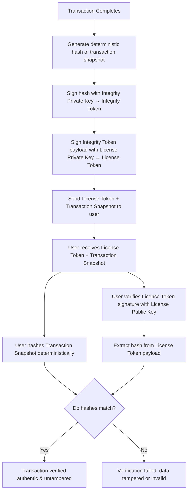

# Uhpenry Transaction Signing & Verification Flow

This document explains the lifecycle of transaction data signing and verification used in Uhpenry.

---

## Flow Overview

When a transaction completes, we:

1. Generate a **deterministic hash** of the transaction snapshot to ensure consistent and tamper-proof data representation.
2. Sign the hash with an **Integrity Private Key** to produce an **Integrity Token**. This token attests that the transaction hash has not been altered.
3. Sign the payload of the Integrity Token with a **License Private Key** to produce a **License Token**. This token represents the user's license and provides an additional layer of trust.
4. Provide the License Token and the transaction snapshot to the user.
5. The user verifies the License Token signature using the License Public Key.
6. The user generates their own deterministic hash of the transaction snapshot and compares it to the hash inside the License Token payload.
7. If the hashes match, the transaction data is verified to be authentic and untampered.

---

## Mermaid Diagram

