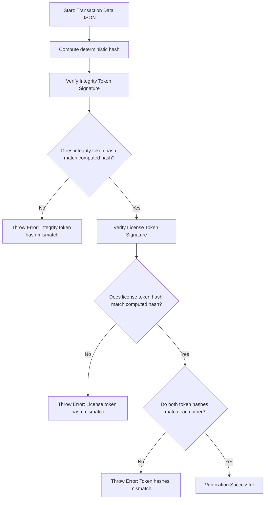

# Node.js Example

This example shows how to verify a transaction's integrity and license tokens using Ed25519 JWT signatures and deterministic hashing.

---

## Setup

- Replace the sample `data` object with your actual transaction JSON.
- Replace the placeholder public keys with your Uhpenry `.well-known` public keys.
- Replace example JWT tokens with actual integrity and license tokens.

---

## Usage

1. Compute deterministic hash of the transaction data.
2. Verify the integrity token signature and payload.
3. Verify the license (signer) token signature and payload.
4. Confirm hashes inside tokens match the computed hash and each other.

---

## Run

```bash
tsx src/examples/nodejs/index.ts
```

---

## Example snippet

```ts
import { JWK, jwtVerify } from 'jose';
import { hashDeterministicJson } from '../../lib/helpers';

const data = { /* your transaction JSON */ };
const integrityPublicKey = { keys: [ /* your integrity public key */ ] } as JWK;
const signerPublicKey = { keys: [ /* your signer public key */ ] } as JWK;

const hash = hashDeterministicJson(data);

async function verifyTransactionFlow(integrityToken: string, signerToken: string) {
  const { payload: integrityPayload } = await jwtVerify(integrityToken, integrityPublicKey);
  const { payload: signerPayload } = await jwtVerify(signerToken, signerPublicKey);

  if (integrityPayload.hash !== hash || signerPayload.hash !== hash)
    throw new Error('Hash mismatch');

  if (integrityPayload.hash !== signerPayload.hash)
    throw new Error('Token hashes do not match');

  return { valid: true, hash: hash };
}

```

---

## Mermaid Diagram


